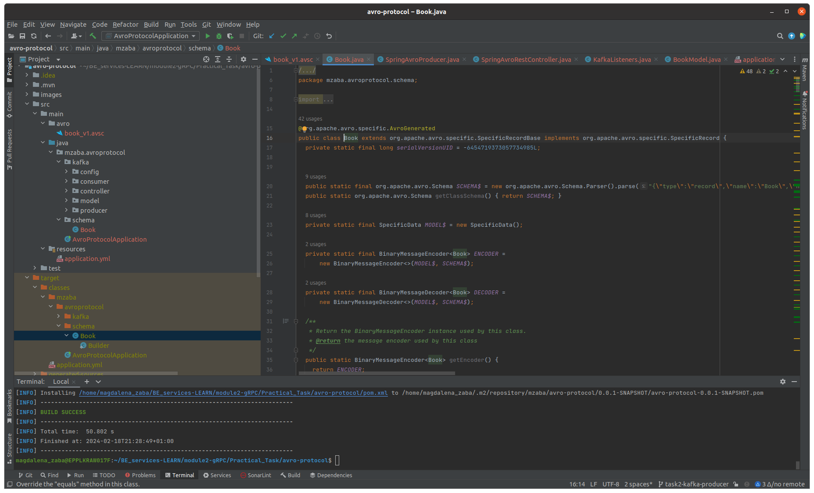

# avro-protocol
This project is a practical task 2 for the course Java Advanced: Backend Services - Module 2 : RPC Protocols and Data Formats.

## Description

The project is a Spring Boot REST application with Kafka Producer and Consumer using Avro to serialize and deserialize messages.

### Task 2.1 - Avro schema
- Avro schema is generated from `book_v1.avsc` file

  

### Task 2.2 - Kafka Producer
-  Kafka producer is created that sends a simple message to a topic serializing it using Avro

### Task 2.3 - Kafka Consumer
-  Kafka Consumer is created which listens to a topic for a message, deserializes the message, and prints it.